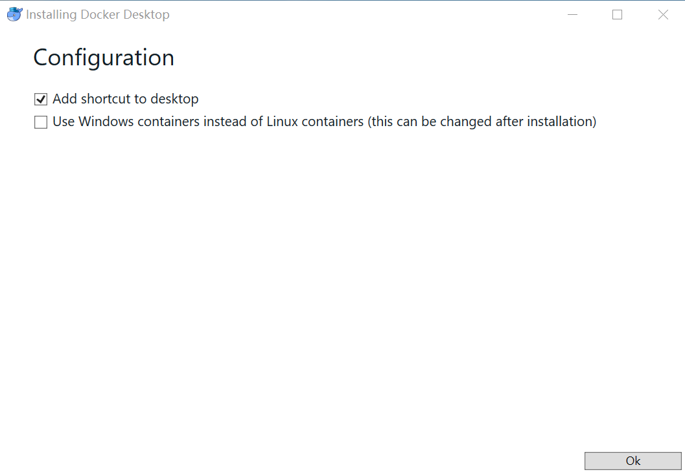
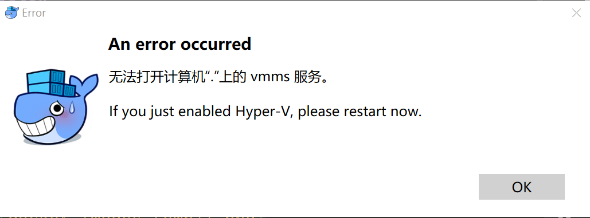
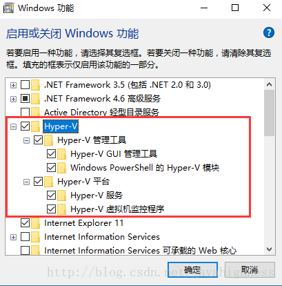
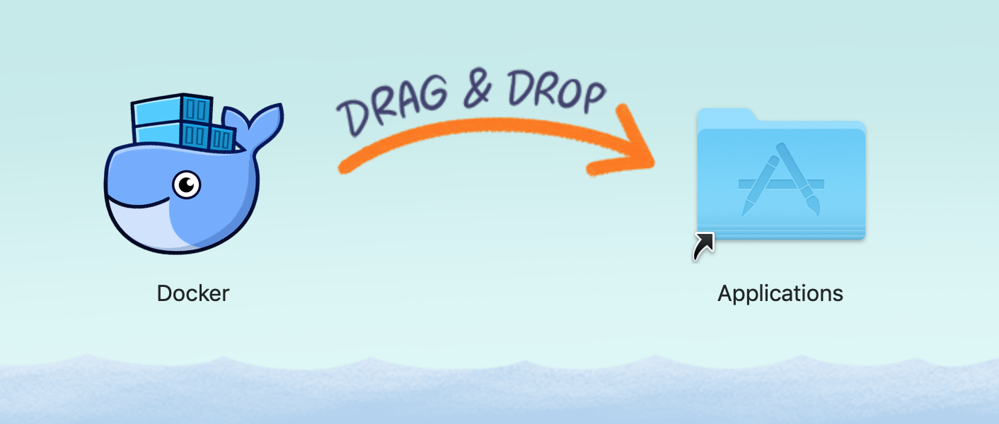
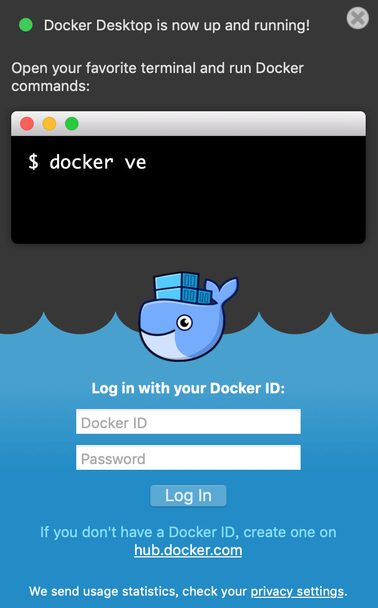
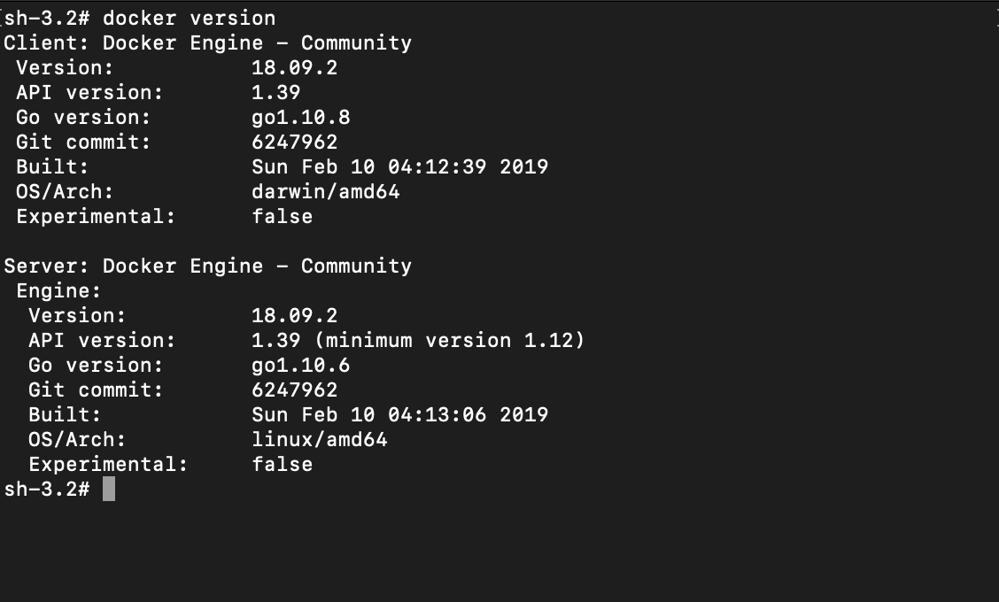

## How to install Linux on Docker

### 1. Install Docker

The tutorial about how to install docker on each platform are available on 
<https://docs.docker.com/install/>

Generally, you can download the installer according to your system.

#### Windows 10

Actually WSL is preferred on Windows 10, but you can also try Docker. 

1. Download 
<https://download.docker.com/win/stable/Docker%20for%20Windows%20Installer.exe>
and install it

2. Run the Docker Desktop app and wait until it is up and running, and close it. You may meet an error about the Hyper-V service, and then you need to open it and restart your computer.


3. Open your favorite terminal and run `docker version` to verify the installation

#### Windows 7 or below

Old versions of docker may be supported on Windows 7 or below, but it is not recommended for you to use these systems now.

#### Mac OS:

1. Download 
<https://download.docker.com/mac/stable/Docker.dmg>
and install it.

2. Run the Docker Desktop app and wait until it is up and running, and close it.

3. Open your favorite terminal and run `docker version` to verify the installation



#### Linux 

You may notice that docker can be installed on Linux, and performs much better on it! The official release of docker supports CentOS, Debian, Fedora, Ubuntu and most other Linux distributions.

### 2. Create a Linux Image with Docker

You can find various images of Linux Distributions on 
<https://hub.docker.com/search?category=os&source=verified&type=image>. Here is brief list of it:

+ ubuntu: <https://hub.docker.com/_/ubuntu> (Ubuntu is a Debian-based Linux operating system based on free software.)
+ alpine: <https://hub.docker.com/_/alpine> (A minimal Docker image based on Alpine Linux with a complete package index and only 5 MB in size!)
+ centos: <https://hub.docker.com/_/centos> (The official build of CentOS.)
+ debian: <https://hub.docker.com/_/debian> (Debian is a Linux distribution that's composed entirely of free and open-source software.)
+ amazonlinux: <https://hub.docker.com/_/amazonlinux> (Amazon Linux provides a stable, secure, and high-performance execution environment for applications.)
+ fedora: <https://hub.docker.com/_/fedora> (Official Docker builds of Fedora)
+ and many others

First you should choose a Linux Distributions on your favour, the following tutorial will take ubuntu 18.04 as an example. But if you choose other docker images, the procedure will be very similar, you only need to change the image and container names.

The following commands can be ran on any OS with docker installed.

1. Create a plain file named Dockerfile and edit it like:

   ``` dockerfile
   FROM ubuntu:18.04
   RUN sed -i 's:^path-exclude=/usr/share/man:#path-exclude=/usr/share/man:' \
           /etc/dpkg/dpkg.cfg.d/excludes
   RUN sed -i 's/archive.ubuntu.com/ftp.sjtu.edu.cn/g' /etc/apt/sources.list
   RUN apt-get update && \
       apt-get install -y \
       g++\
       man \
       manpages-posix\
       vim
   RUN echo "root:root" | chpasswd
   RUN useradd -rm -d /home/newuser -s /bin/bash -g root -G sudo -u 1000 newuser
   USER newuser
   WORKDIR /home/newuser
   ```

   which is a recipe to build a container with some packages installed and a normal user(newuser) created. Also the password for the root user is just "root".

2. Run the command ``docker build --tag ubuntu280 [path to the directory containing dockerfile]` to build the container.

3. Run the command like `docker run -dit --volume=/Users/zze1/Desktop/VE280:/home/newuser/code  --name ubuntu ubuntu280:latest ` to run the container built and named it ubuntu. `--volume=[absolute path outside]:[path in the docker]` so that can share the content between the devices.

4. Run the command `docker exec -it ubuntu /bin/bash` to enter the container by launching a `bash` process on it

5. Run the command `docker exec -it ubuntu /bin/bash` to enter the container by launching a `bash` process on it.

6. Use Ctrl+D or `exit` to exit the container, and run the command `docker ps` to check the status of running containers.
  


### 3. Use a Docker Container

When you enter the container with a shell (eg. `bash`), you can use the container just like it is installed on a bare machine.

If you restart your system, the docker containers will be stopped, then you can run the command `docker start ubuntu` to start the container before you enter it.

